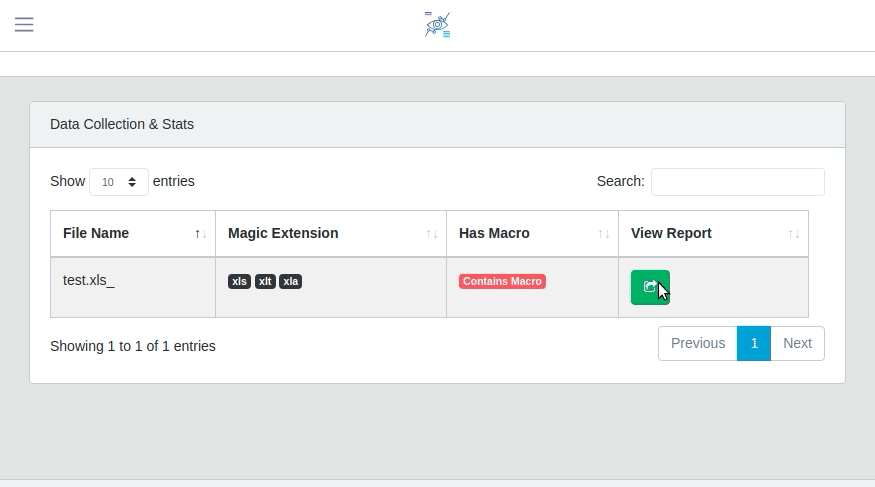

 

# Sharingan
A project to visualize vba macro into graph to show function and code flow. 

# Little Demo

# Resources
For the development of this project different free and open source libraries were used. You can find more details and 
information in [SHOUTOUT.md](./stuff/SHOUTOUT.md)

# LICENSE 
Project is under MIT License. More information [LICENSE](./stuff/LICENSE)