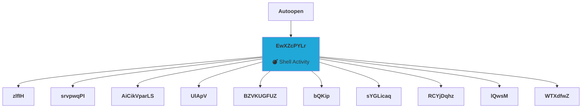

  
   
  
  
  
# Sharingan  
A flask python based project for static analysis of office documents. Currently development is in progress. This  
project will help to extract different artifices and information from the document. Currently project is show some basic  
information of office file and embedded macro. (work in progress)  
  
## Extraction of macro code  
Currently project is enable to extract macro form office document and showing them on web UI.  
- :information_source: **Work In Progress**
  
## Visualization of macro content  
Allot of malicious document contains macro code in it. In this project we'll try to achive some visualization and flow  
diagram of macro code.  
- Currently project is visualizing internal defined function function within vba code.   

> - Simple graph generate for [16ba8f5d604b4b9a366ae2d5b2107e68](https://github.com/InQuest/malware-samples/blob/master/2018-04-GandCrab-Swarm/99eb1d90eb5f0d012f35fcc2a7dedd2229312794354843637ebb7f40b74d0809/99eb1d90eb5f0d012f35fcc2a7dedd2229312794354843637ebb7f40b74d0809.doc)
> - Find more details on demo
- We'll expend the scope and visualize the flow of macro code instead of functions.   
     
#### Resource extraction  
:sob: Yet to come  
  
#### Parsing of OOXML and URL extraction  
:sob: Yet to come  
  
#### Support for external modules ??  
:sob: Yet to come  
  
# Overview of UI  
You can access demo on herokuapp. https://isharingan.herokuapp.com  
  
  
We used office samples from following resources,  
- We have some reports for demo  
-- [InQuest](https://github.com/InQuest/malware-samples)   
  
# How to deploy   
This project is build on python 3.6. Ensure installed on system, rest follow as,

    git clone https://github.com/iAbdullahMughal/Sharingan.git
    cd Sharingan
    pip3 install requirements.txt (sudo if required)
    python3 app.py
 

# Resources consumed  
For the development of this project different free and open source libraries were used. You can find more details and   
information in [SHOUTOUT.md](./stuff/SHOUTOUT.md)  
  
# LICENSE 
Project is under MIT License. More information [LICENSE](./stuff/LICENSE)